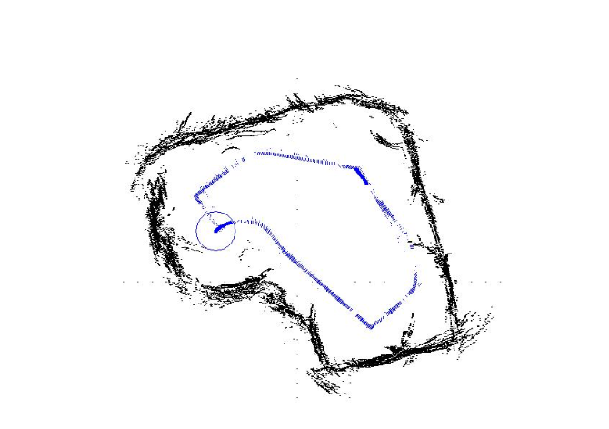
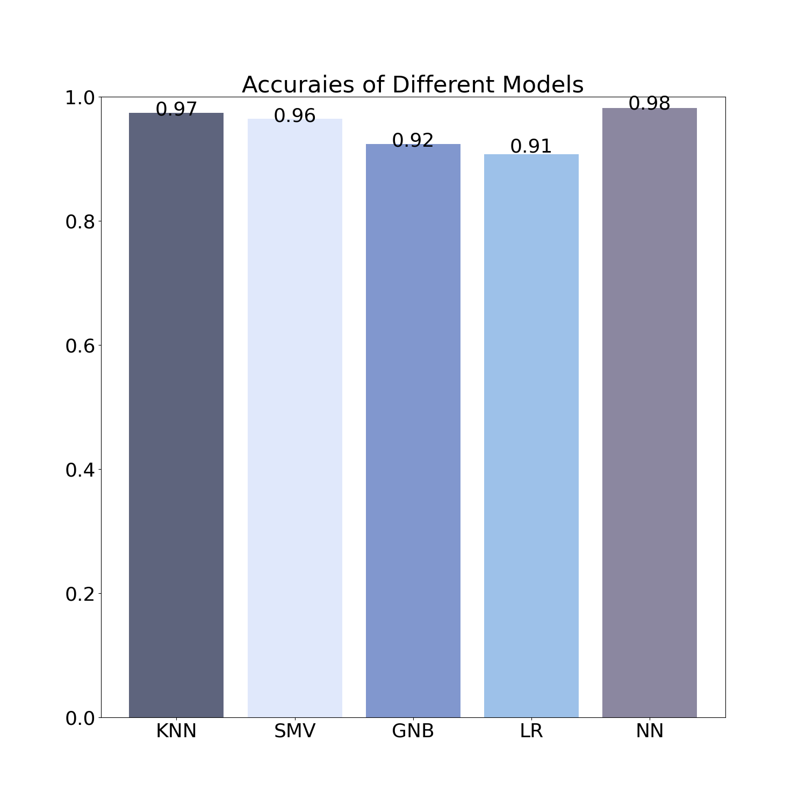
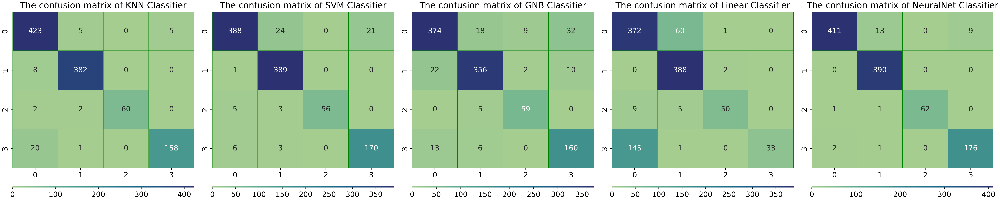
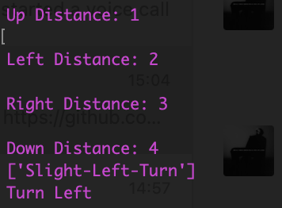
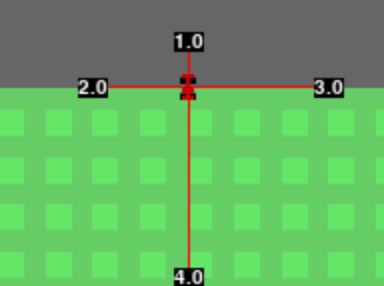
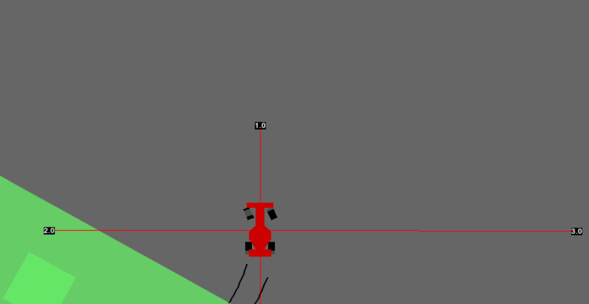
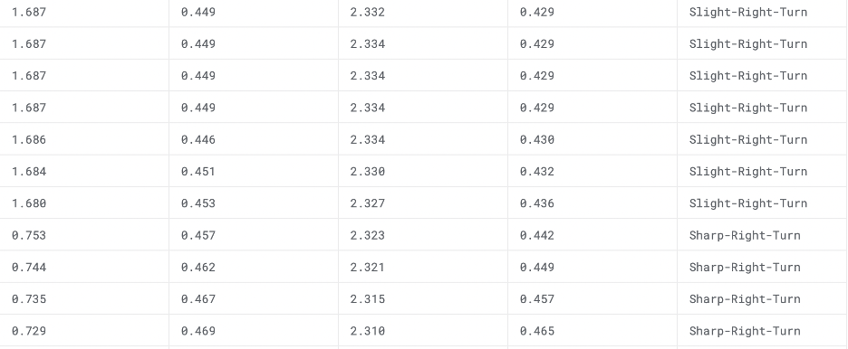

# Robots Movement Classification
</img>
This tool can be used to determine the position and orientation direction based on the data detected by sensors.

## Mission
Mission of our algorithm was to predict the movement of the user's robot, so users can get the turning dirtion for their robots at specific corner, or even design a route for robots.

## Project objective

Our algorithm will identify the automotive vehicle direction. During the designing of the autopilot vehicle’s road mapping. Engineers could collect the car’s distance or super sound sensor data at turning corners. Based on the data analyzed, the suggested turning direction will be printed out. 

The algorithm is to use the ultrasonic sensor data or distance reading data from the wall-followed robot to train different models. The machine learning model can be used to determine the position and orientation direction. After training and comparing different machine learning models then choose the model that has the highest prediction.

This algorithm could be used in some of the storage. Like shipping storage, there will be some of the autopilot robotics designed to deliver with the setting path. Based on the data collection, the storage manager could have the direction printed out to determine if the automotive vehicle followed the setting or not. Similarly, any industry that uses a robot running in some fixed routes, can locate their robots depend on our software.

## Repository Structure
 ```
.
├── DATA
│   ├── sensor_readings_24.csv
│   └── sensor_readings_4.csv
├── doc
│   └── presentation.ipynb
├── draft_code
│   ├── SVM_GaussianGNB_data24.ipynb
│   ├── SVM_GaussianGNB_data4.ipynb
│   └── neuralnet_lineaerclassifer.py
├── src
│   └── Classifiers.py
├── LICENSE
├── README.md
├── RMC_ENV_SETUP.bash
└── env_RMC.yml
 ```

## Enviroment Setup
```
conda create -n env_RMC python=3.9
conda env update -n env_RMC -f env_RMC.yml
conda activate env_RMC
```
Or
```
bash RMC_ENV_SETUP.bash
conda activate env_RMC
```

## Machine Learning Algorithm Comparison

Different machine learning algorithms will have different effects on different projects, so we tested five possible machine learning algorithms. The five algorithms are:

### 1.	Linear Classification: 
The Ridge regressor has a classifier variant: RidgeClassifier. This classifier first converts binary targets to {-1, 1} and then treats the problem as a regression task, optimizing the same objective as above. The predicted class corresponds to the sign of the regressor’s prediction. For multiclass classification, the problem is treated as multi-output regression, and the predicted class corresponds to the output with the highest value.
### 2.	Support Vector Machine: 
Support vector machines (SVMs) are a set of supervised learning methods used for classification, regression and outliers’ detection.

### 3.	KNN Classification: 
Neighbors-based classification is a type of instance-based learning or non-generalizing learning: it does not attempt to construct a general internal model, but simply stores instances of the training data. Classification is computed from a simple majority vote of the nearest neighbors of each point: a query point is assigned the data class which has the most representatives within the nearest neighbors of the point.
### 4.	Neutral Network:
Neural networks, also known as artificial neural networks (ANNs) or simulated neural networks (SNNs), are a subset of machine learning and are at the heart of deep learning algorithms. Their name and structure are inspired by the human brain, mimicking the way that biological neurons signal to one another.
### 5.	Gaussian Naive Bayes:
Naive Bayes methods are a set of supervised learning algorithms based on applying Bayes’ theorem with the “naive” assumption of conditional independence between every pair of features given the value of the class variable. GaussianNB implements the Gaussian Naive Bayes algorithm for classification.
</img>

Through our testing with the data we use, KNN Classification got the highest accuracy of 98% in all three kinds of datasets. The following figures shows the comparison for all five machine learning algorithms. We can see clearly the different of the accuracy rate of these 5 algorithms. Another figure shows the accuracy rate and confusion matrix of all 5 Machine Learning Algorithm.

</img>

## Example: Action Planning of Autonomous Vehicle
The current vehicle is normally equipped with ultrasound sound sensors. It can determines the distances between the objectives
and vehicle. The distances data can be used to determine whether the vehicle is safe or not. With multiple ultrasound sensors, 
the vehicle will have the ability to determine where the wall is and even figure out whether to turn left or turn right. However, it could be unstable if we simply develop a algorithm to analyze the data of ultrasound sensors and determine the action in real time since it could have high computational cost and the algorithm could miss some special cases. So we could implement the pre-trained model from wall-followed robots.
We create a car simulation based on the [car racing](https://www.gymlibrary.dev/environments/box2d/car_racing/). Here is how it works:
### Step 1
Run the example python script.
```
python3 python3 exp_automobile.py
```
### Step 2
Select one of the trained models.\
GNB: Gaussian Naive Bayes.\
NN: Neural Network.\
SVM: Support Vector Machines.\
LR: Linear Regression.\
</img>

### Step 3
Enter the four distances from ultrasound sensors. The determined action will show on the terminal.\
</img>
The distances will show on the simulation as well.\
</img>

### Step 4
The car in the simulation will move based on the determined action.\
</img>

## About Datasets:
•	The data were collected as the SCITOS G5 navigated through the room following the wall in a clockwise direction, for 4 
•	rounds. To navigate, the robot uses 24 ultrasound sensors arranged circularly around its "waist". The numbering of the ultrasound sensors starts at the front of the robot and increases in clockwise direction.
•	The provided files comprise three diferent data sets.
i.	The first one contains the raw values of the measurements of all 24 ultrasound sensors and the corresponding class label (Moving forward, turning left, etc). Sensor readings are sampled at a rate of 9 samples per second.
ii.	The second one contains four sensor readings named 'simplified distances' and the corresponding class label l (Moving forward, turning left, etc). These simplified distances are referred to as the 'front distance', 'left distance', 'right distance' and 'back distance'. They consist, respectively, of the minimum sensor readings among those within 60 degree arcs located at the front, left, right and back parts of the robot.
iii.	The third one contains only the front and left simplified distances and the corresponding class labell (Moving forward, turning left, etc).

### Content
#### File sensorreadings24.csv:
###### US1: ultrasound sensor at the front of the robot (reference angle: 180°) - (numeric: real)
###### US2: ultrasound reading (reference angle: -165°) - (numeric: real)
###### US3: ultrasound reading (reference angle: -150°) - (numeric: real)
###### US4: ultrasound reading (reference angle: -135°) - (numeric: real)
###### US5: ultrasound reading (reference angle: -120°) - (numeric: real)
###### US6: ultrasound reading (reference angle: -105°) - (numeric: real)
###### US7: ultrasound reading (reference angle: -90°) - (numeric: real)
###### US8: ultrasound reading (reference angle: -75°) - (numeric: real)
###### US9: ultrasound reading (reference angle: -60°) - (numeric: real)
###### US10: ultrasound reading (reference angle: -45°) - (numeric: real)
###### US11: ultrasound reading (reference angle: -30°) - (numeric: real)
###### US12: ultrasound reading (reference angle: -15°) - (numeric: real)
###### US13: reading of ultrasound sensor situated at the back of the robot (reference angle: 0°) - (numeric: real)
###### US14: ultrasound reading (reference angle: 15°) - (numeric: real)
###### US15: ultrasound reading (reference angle: 30°) - (numeric: real)
###### US16: ultrasound reading (reference angle: 45°) - (numeric: real)
###### US17: ultrasound reading (reference angle: 60°) - (numeric: real)
###### US18: ultrasound reading (reference angle: 75°) - (numeric: real)
###### US19: ultrasound reading (reference angle: 90°) - (numeric: real)
###### US20: ultrasound reading (reference angle: 105°) - (numeric: real)
###### US21: ultrasound reading (reference angle: 120°) - (numeric: real)
###### US22: ultrasound reading (reference angle: 135°) - (numeric: real)
###### US23: ultrasound reading (reference angle: 150°) - (numeric: real)
###### US24: ultrasound reading (reference angle: 165°) - (numeric: real)
###### Classes: Move-Forward, Slight-Right-Turn, Sharp-Right-Turn, Slight-Left-Turn

#### File: sensorreadings4.csv:
###### SD_front: minimum sensor reading within a 60 degree arc located at the front of the robot - (numeric: real)
###### SD_left: minimum sensor reading within a 60 degree arc located at the left of the robot - (numeric: real)
###### SD_right: minimum sensor reading within a 60 degree arc located at the right of the robot - (numeric: real)
###### SD_back: minimum sensor reading within a 60 degree arc located at the back of the robot - (numeric: real)
###### Classes: Move-Forward, Slight-Right-Turn, Sharp-Right-Turn, Slight-Left-Turn

#### File: sensorreadings2.csv:
###### SD_front: minimum sensor reading within a 60 degree arc located at the front of the robot - (numeric: real)
###### SD_left: minimum sensor reading within a 60 degree arc located at the left of the robot - (numeric: real)
###### Classes: Move-Forward, Slight-Right-Turn, Sharp-Right-Turn, Slight-Left-Turn

</img>
###### Datasets Example in sensorreadings4.csv

##### These datasets were downlaoded from the UCI Machine Learning Repository
Lichman, M. (2013). UCI Machine Learning Repository [http://archive.ics.uci.edu/ml]. Irvine, CA: University of California, School of Information and Computer Science. 

## Usage
1.user will uopload their distance or supersound data (.CSV) to the XXX.\\
2.based on the previous trained machine learning modle, it will analyze the data to generate the turning direction.\\
3.The result will be print out.\\

## Appendix
### test
The codes were passed through smoke test, one shot test, and edge test.
### Pylint
The codes were made into PEP8 compliant with pylint.
### Bug report

### Extensions

### Contributions
