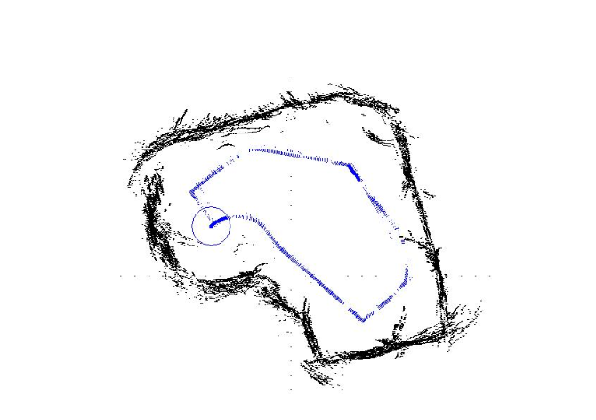

# Robots Movement Classification
This tool can be used to determine the position and orientation direction based on the data detected by sensors.

## Mission
Mission of our algorithm was to predict the movement of the user's robot, so users can get the turning dirtion for their robots at specific corner, or even design a route for robots.

## Project objective

Our algorithm will identify the automotive vehicle direction. During the designing of the autopilot vehicle’s road mapping. Engineers could collect the car’s distance or super sound sensor data at turning corners. Based on the data analyzed, the suggested turning direction will be printed out. 

</img>

The algorithm is to use the ultrasonic sensor data or distance reading data from the wall-followed robot to train different models. The machine learning model can be used to determine the position and orientation direction. After training and comparing different machine learning models then choose the model that has the highest prediction.

This algorithm could be used in some of the storage. Like shipping storage, there will be some of the autopilot robotics designed to deliver with the setting path. Based on the data collection, the storage manager could have the direction printed out to determine if the automotive vehicle followed the setting or not. Similarly, any industry that uses a robot running in some fixed routes, can locate their robots depend on our software.

## Repository Structure
 ```
.
├── DATA
│   ├── sensor_readings_24.csv
│   └── sensor_readings_4.csv
├── doc
│   └── presentation.ipynb
├── draft_code
│   ├── SVM_GaussianGNB_data24.ipynb
│   ├── SVM_GaussianGNB_data4.ipynb
│   └── neuralnet_lineaerclassifer.py
├── src
│   └── Classifiers.py
├── LICENSE
├── README.md
├── RMC_ENV_SETUP.bash
└── env_RMC.yml
 ```

## Enviroment Setup
```
conda create -n env_RMC python=3.9
conda env update -n env_RMC -f env_RMC.yml
conda activate env_RMC
```
Or
```
bash RMC_ENV_SETUP.bash
conda activate env_RMC
```
