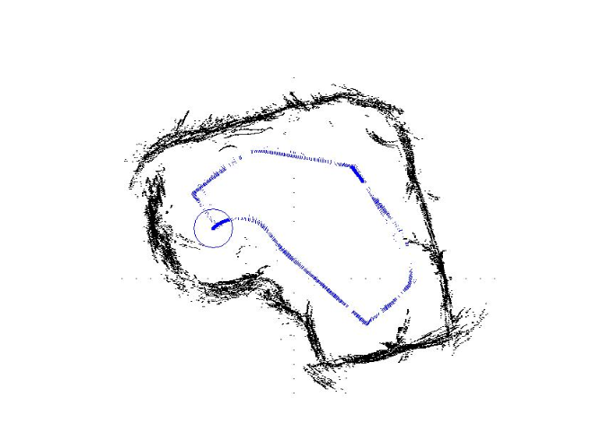
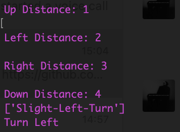

# Background
</img>
The project compared five different clssification algorithms to train a model that can predict the robots movement by processing the ultrasound sensors data. The model can be further implemented on Simultaneous Localization and Mapping (SLAM) and Motion Planning of the autopilot vehicle.  
# User profile
Our algorithm will identify the automotive vehicle direction. During the designing of the autopilot vehicle’s road mapping. Engineers could collect the car’s distance or ultrasound sensor data at turning corners. The suggested turning direction is then determined based on the data.
One of use case is smart warehouse. There are autopilot robotics designed to deliver package with the setting path. Based on the data collection, the monitoring system could have the direction predicted by the classification model to determine if the automotive vehicle followed the setting or not. Similarly, any industry that uses a robot running in some fixed routes, can locate their robots depend on our trained model.
# Data sources. 
</img>
•	The data were collected as the SCITOS G5 navigated through the room following the wall in a clockwise direction, for 4 rounds. To navigate, the robot uses 24 ultrasound sensors arranged circularly around its "waist". The numbering of the ultrasound sensors starts at the front of the robot and increases in clockwise direction.\
•	The provided files comprise three diferent data sets.\
  &nbsp; i.	The first one contains the raw values of the measurements of all 24 ultrasound sensors and the corresponding class label (Moving forward, turning left, etc). Sensor readings are sampled at a rate of 9 samples per second.\
  ii.	The second one contains four sensor readings named 'simplified distances' and the corresponding class label l (Moving forward, turning left, etc). These simplified distances are referred to as the 'front distance', 'left distance', 'right distance' and 'back distance'. They consist, respectively, of the minimum sensor readings among those within 60 degree arcs located at the front, left, right and back parts of the robot.\
  iii.	The third one contains only the front and left simplified distances and the corresponding class labell (Moving forward, turning left, etc).
## Content
### File sensorreadings24.csv:
US1: ultrasound sensor at the front of the robot (reference angle: 180°) - (numeric: real)\
US2: ultrasound reading (reference angle: -165°) - (numeric: real)\
US3: ultrasound reading (reference angle: -150°) - (numeric: real)\
US4: ultrasound reading (reference angle: -135°) - (numeric: real)\
US5: ultrasound reading (reference angle: -120°) - (numeric: real)\
US6: ultrasound reading (reference angle: -105°) - (numeric: real)\
US7: ultrasound reading (reference angle: -90°) - (numeric: real)\
US8: ultrasound reading (reference angle: -75°) - (numeric: real)\
US9: ultrasound reading (reference angle: -60°) - (numeric: real)\
US10: ultrasound reading (reference angle: -45°) - (numeric: real)\
US11: ultrasound reading (reference angle: -30°) - (numeric: real)\
US12: ultrasound reading (reference angle: -15°) - (numeric: real)\
US13: reading of ultrasound sensor situated at the back of the robot (reference angle: 0°) - (numeric: real)\
US14: ultrasound reading (reference angle: 15°) - (numeric: real)\
US15: ultrasound reading (reference angle: 30°) - (numeric: real)\
US16: ultrasound reading (reference angle: 45°) - (numeric: real)\
US17: ultrasound reading (reference angle: 60°) - (numeric: real)\
US18: ultrasound reading (reference angle: 75°) - (numeric: real)\
US19: ultrasound reading (reference angle: 90°) - (numeric: real)\
US20: ultrasound reading (reference angle: 105°) - (numeric: real)\
US21: ultrasound reading (reference angle: 120°) - (numeric: real)\
US22: ultrasound reading (reference angle: 135°) - (numeric: real)\
US23: ultrasound reading (reference angle: 150°) - (numeric: real)\
US24: ultrasound reading (reference angle: 165°) - (numeric: real)\
Classes: Move-Forward, Slight-Right-Turn, Sharp-Right-Turn, Slight-Left-Turn

### File: sensorreadings4.csv:
SD_front: minimum sensor reading within a 60 degree arc located at the front of the robot - (numeric: real)\
SD_left: minimum sensor reading within a 60 degree arc located at the left of the robot - (numeric: real)\
SD_right: minimum sensor reading within a 60 degree arc located at the right of the robot - (numeric: real)\
SD_back: minimum sensor reading within a 60 degree arc located at the back of the robot - (numeric: real)\
Classes: Move-Forward, Slight-Right-Turn, Sharp-Right-Turn, Slight-Left-Turn
##### Datasets Example in sensorreadings4.csv
| SD_front |  SD_left  |  SD_right |  SD_back  |  Classes  |
|----------|-----------|-----------|-----------|-----------|
|  1.687   |   0.449   |   2.332   |   0.429   |Slight-Right-Turn|
|  0.914   |   0.632   |   2.536   |   1.123   |Move-Forward|
|  0.830   |   0.660   |   2.475   |   1.211   |Sharp-Right-Turn|
|  1.158   |   2.295   |   1.385   |   2.366   |Slight-Left-Turn|


### File: sensorreadings2.csv:
SD_front: minimum sensor reading within a 60 degree arc located at the front of the robot - (numeric: real)\
SD_left: minimum sensor reading within a 60 degree arc located at the left of the robot - (numeric: real)\
Classes: Move-Forward, Slight-Right-Turn, Sharp-Right-Turn, Slight-Left-Turn
# Use cases
The current vehicle is normally equipped with ultrasound sound sensors. It can determines the distances between the objectives
and vehicle. The distances data can be used to determine whether the vehicle is safe or not. With multiple ultrasound sensors, 
the vehicle will have the ability to determine where the wall is and even figure out whether to turn left or turn right. However, it could be unstable if we simply develop a algorithm to analyze the data of ultrasound sensors and determine the action in real time since it could have high computational cost and the algorithm could miss some special cases. So we could implement the pre-trained model from wall-followed robots.
We create a car simulation based on the [car racing](https://www.gymlibrary.dev/environments/box2d/car_racing/). Here is how it works:
### Step 1
Run the example python script.
```
python3 exp_automobile.py
```
### Step 2
Select one of the trained models.\
GNB: Gaussian Naive Bayes.\
NN: Neural Network.\
SVM: Support Vector Machines.\
LR: Linear Regression.\
</img>

### Step 3
Enter the four distances from ultrasound sensors. The determined action will show on the terminal.\
</img>\
The distances will show on the simulation as well.\
</img>

### Step 4
The car in the simulation will move based on the determined action.\
</img>

